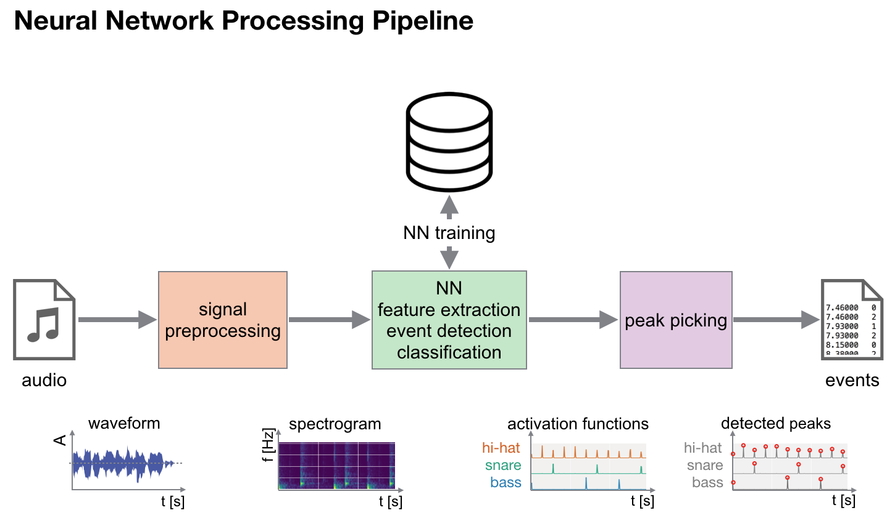
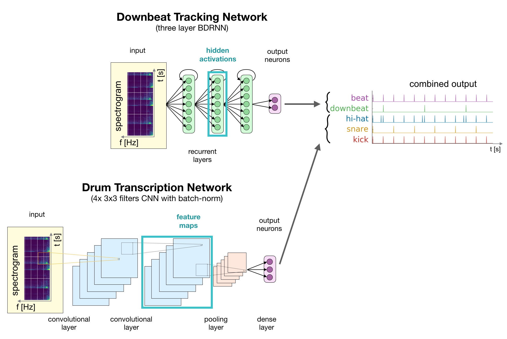
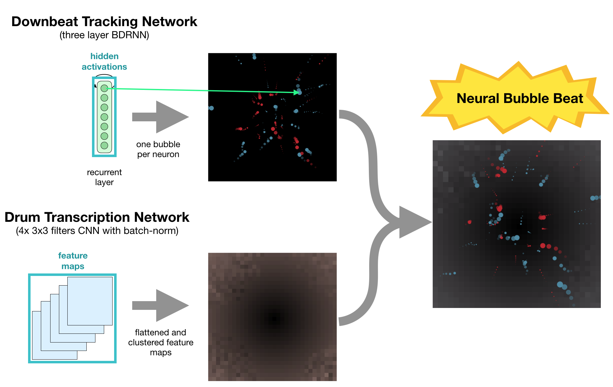
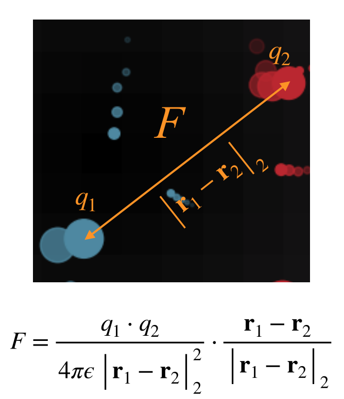

# Neural Bubble Beat

Florian Henkel
Filip Korzeniowski
Matthias Dorfer
Richard Vogl

The aim of our Hack is to provide an appealing, artistic visual interpretation of neural network activations while processing music.
We take a downbeat and drum transcription network and use the activations of certain layers to control elements of the visualization.

## Method

To this end we use two different neural network based MIR approaches:
- A bidirectional RNN based downbeat tracking network [1]
- A CNN based drum transcription network [2]
- A deep chroma network [3]

  

 Figure 1: Processing pipeline of used neural network based approaches.

Figure 1 shows an overview of the processing pipeline using neural networks which are used to implement the beat tracking and drum transcription method.

For the visualization we take the hidden activations of certain layers to control elements.
In case of the beat tracking network, the activations of the second recurrent layer are used.
For the drum transcription CNN, the activations of the last convolution filters are extracted.

  

 Figure 2: Network architectures with highlighted hidden activations in turquois which are used to control the visualization.

Figure 2 visualizes the network architectures while pointing out the positions of the layers from which the actications are extracted.

  

 Figure 3: Hidden activations taken from the beat tracking network control the bubbles, by changing their virtual "electric charge", while hidden activations taken from the drum transcription network control the backroung lightness. 

The activations of the last features maps from the drum transcription network are clustered according to their activity and visualized as single pixels for the background of the visualization.
The first and second components of the PCA of outputs of an additional deep chroma net, control the hue and saturation of the background.
The main bubble visualization is controlled by the activations of the last recurrent layer of the beat tracking network. 
See Figure 3.
Activations of each neuron represent a virtual "electric charge" which is used to calculate forces of attraction between the single bubbles according to Coloumb's law.
Additionally a gravitational force towards the screen center draws the particles (a.k.a. bubbles) back together.
C.f. Figure 4.

  

 Figure 4: The "electric charce" provided by the activations is used to calculate forces of attraction using Coloumb's law. 

## References

[1] Sebastian Böck, Florian Krebs, and Gerhard Widmer. Joint beat and downbeat tracking with recurrent neural networks. In Proc. 17th Intl Society for Music Inform tion Retrieval Conf (ISMIR), 2016. 
[2] Richard Vogl, Matthias Dorfer, Gerhard Widmer, and Peter Knees, “Drum transcription via joint beat and drum modeling using convolutional recurrent neural networks,” in Proc. 18th Intl. Soc. for Music Information Retrieval Conf. (IS- MIR), Suzhou, CN, Oct. 2017.  
[3] F. Korzeniowski and G. Widmer, “Feature Learning for Chord Recognition: The Deep Chroma Extractor,” in Proceedings of the 17th International Society for Music Information Retrieval Conference (ISMIR), New York, USA, 2016.  
