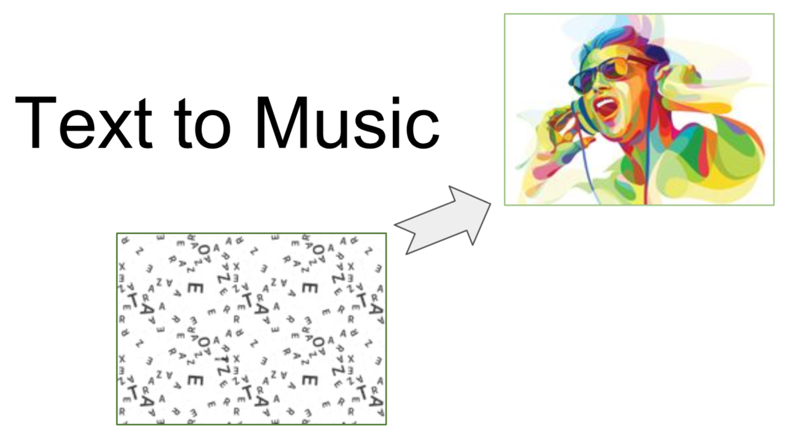

### Abstract ###
Automatic music generation is the one of most interesting fields in music informatics. Automatic music generation has been studies for a long time since before birth of computer. For exmaple, Morzart proposed a musical dice game (Musikalisches Würfelspiel) to create music. Dices decide measure part and we can obrain music by combination of these selected measures. There are a variety of methods to create music by using hands of body movements, mathematical shapes, and text. In this project, we focus on using texts to generate music.

### Our Proposal ###
It is boring to listen to an audio book read by a human. What if it is sung with a background music?
Keepig that as motivation, this project tries to combine words sung by different singers. Text-to-Music offers following
two options for now:

  - Take words in a sentence and merge the same words sung by different singers\
. Output will be a wav audio file consists of the actual words with music\
.
  - Take the whole sentence and output the most similar lyrics sung a by a singer. Output will be the same as first step

## Process followed
### Words to Music
  - An opernsource [dataset](https://github.com/mattmcvicar/lyric_database/tree\
/master/aligned) was used which has aligned words for each song though iit \
is not very accurate.
  - Take an audio wav file of a song. Sync it with the lyrics start manually.
  - Divide the audio file into words based wav file.
  - Now that we have files with singers singing with music available for each word. We can combine different words.

### Sentence to Music
  - Get time-windowed lyrics in srt file for a song.
  - Split song's audio wav file using time-window of srt file.
  - Now that we have musicians singing each lyrics separately we can combine them as we want. This is done for many different songs.

### Usage ###
(1) Words to Music
- $ python app.py
- Input: text data that have plurial words with spaces (***.py)
e.g. "Hey I just met you"
- Output: wav audio file will be generated.

(2) Sentences to Music

- Input: text data that have plurial sentences with newline "\n"
e.g. "Try to chase me\nSo call me, maybe\nHey I just met you\n"
- Output: wav audio file will be generated

#### Dependency ####
- Python 3.5
- SoX (Sound eXchange)

### Future Works ###
- We are interested in generating music by not only concatinating parts related to the input, but also depending on moods or impressions or emotions of words. Input texts will be embedded in feature spaces and models will extract textueal features to generate music. 
In this project, there is a limit only to generate music that hava in the dataset. To solve this problem, we need to collect and more data, and unsupervised training method could be applied.
To improve, we can apply Auto-Encoder between textual and audio domains, and it provides end-to-end system.

### References ###
- SoX - Sound eXchange http://sox.sourceforge.net/
- LabROSA Lyrics / Audio Repository https://github.com/mattmcvicar/lyric_database
- 2018:Automatic Lyrics-to-Audio Alignment http://www.music-ir.org/mirex/wiki/2018:Automatic_Lyrics-to-Audio_Alignment
- Lyrics-to-Audio-Alignment https://github.com/rupakvignesh/Lyrics-to-Audio-Alignment
- Melobytes (text to song web application) https://melobytes.com/app/melobytes
- Orpheus (text to song) http://www.orpheus-music.org/v3/index.php

